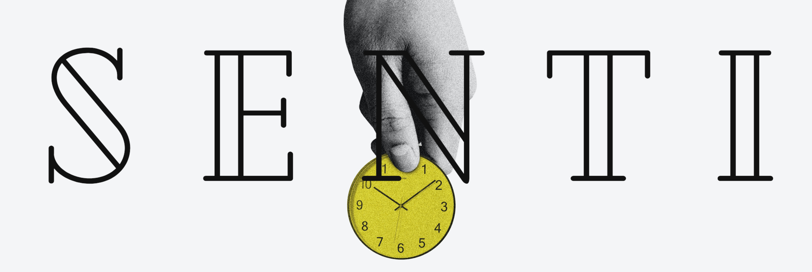

# Financial-advisor-project
**Senti-Application
Author
Stephen Karanja. 6/04/2023.

Description
A simple budgeting application that let's you calculate your daily and monthly income, expenses and savings.

Landing Page
.png) 

Demo
You can demo the site here.

Features
Input your income based on the frequency.
Select your currency, although, there are just two options.
You can input your speculated daily expenses.
You can input your desired monthly savings.

Specifications
Setup/Installation Requirements
Here is a run through of how to set up the application:

Step 1 : Clone this repository using the git clone link:
https://github.com/SKaranjaN/Financial-advisor-project .git
Step 2 : Navigate to the directory:
cd Financial-advisor-project. 
Step 3 : Open the directory created with your favorite IDE. If Atom type atom . if VSCode type code . . This will lauch the editor with the project setup,
Now feel free to hack around the project.
Known Bugs
None currently.
Technologies Used
HTML, CSS and JavaScript.

Support and contact details
# Senti-Application

Author: Stephen Karanja. 6/04/2023.

Description: A simple budgeting application that lets you calculate your daily and monthly income, expenses, and savings.

Landing Page:
 

Demo: You can demo the site here.

Features:
- Input your income based on the frequency.
- Select your currency, although there are just two options.
- You can input your speculated daily expenses.
- You can input your desired monthly savings.

Specifications:

Setup/Installation Requirements:
Here is a run-through of how to set up the application:

1. Clone this repository using the git clone link: https://github.com/SKaranjaN/Financial-advisor-project.git
2. Navigate to the directory: `cd Financial-advisor-project`.
3. Open the directory created with your favorite IDE. If Atom, type `atom .`; if VSCode, type `code .`. This will launch the editor with the project setup. Now feel free to hack around the project.

Known Bugs: None currently.

Technologies Used: HTML, CSS, and JavaScript.

Support and Contact Details:
Primary E-mail Address: skaranja654@gmail.com

License
This is under the MIT license Copyright (c) {2023} {Stephen Karanja}
License: This project is licensed under the MIT License. (c) 2023 Stephen Karanja.